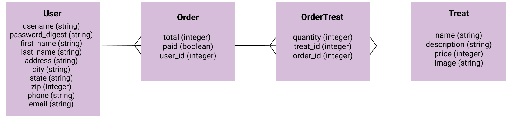

# README
# Chocolat_Boutique_Backend
This is the Ruby on Rails API for Boutique de Chocolat.
Boutique de Chocolat is an e-commerce application that allows users to purchase handcrafted chocolate treats. Application is built with React on the frontend and Ruby on Rails on the backend.

[Link to Frontend](https://github.com/Elronia/Chocolat_Boutique_Frontend)

## Getting Started
1. Install [Homebrew](https://brew.sh/)
    ```$ /bin/bash -c "$(curl -fsSL https://raw.githubusercontent.com/Homebrew/install/master/install.sh)"```
  
2. Install [Ruby](https://www.ruby-lang.org/en/)
    
    ```$ brew install ruby```
3. Install [Rails](https://rubyonrails.org/)
    ```$ gem install rails```
4. Install [PostgreSQL](https://www.postgresql.org/)
    ```$ brew install postgresql```
## Downloading This Project
1. Clone the repo and cd into the folder
2. Bundle Install
    ```$ bundle install```
    
3. Create migrations, migrate and seed:
    ```
    $ rails db:create
    $ rails db:migrate
    $ rails db:seed
4. Last step, launch the rails server!
    ```$ rails s -p 3000```

### ActiveRecord Associations
* There are 4 models with `has_many`, `belongs_to` and `has_many through` associations
### Domain Model
 </img>
## Tech Stack
* React (Frontend: https://github.com/Elronia/Chocolat_Boutique_Frontend)
* Ruby on Rails API (Backend)
* PostgreSQL
* Active Record
* HTML/CSS
* Semantic UI
* Cloudinary
* Stripe API

## Tools
* [Rack CORS](https://github.com/cyu/rack-cors)
* [ActiveModel::Serializer](https://github.com/rails-api/active_model_serializers)


